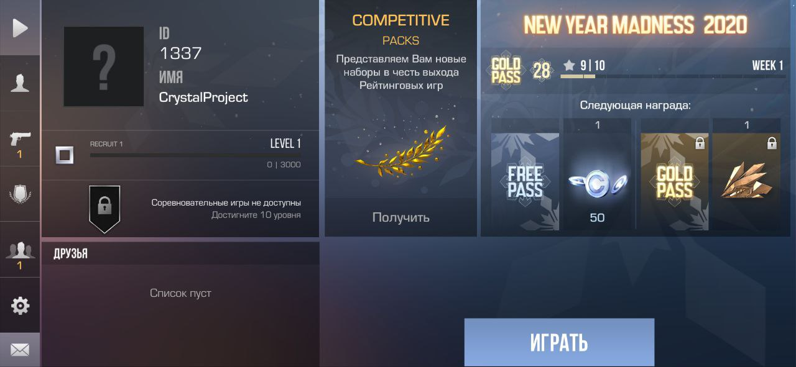

# standoff2-crystal-server
The world first open-source Standoff 2 server written in Crystal with Protobuf

> "Language for humans and computers"

## About
This project is a reverse-engineered implementation of the Standoff 2 game server, built from scratch using the Crystal programming language and Protocol Buffers for efficient network communication. It aims to provide an open-source alternative for understanding and hosting private Standoff 2 game servers.



## Features
- **High Performance**: Built with Crystal for speed and efficiency
- **Protocol Buffers (protobuf.cr)**: Fast and compact binary serialization
- **Open Source**: Fully transparent codebase

## Requirements
- Crystal 1.x or higher
- Protocol Buffer compiler (protoc)
- Brain

## Installation
1. Clone the repository:
```bash
git clone https://github.com/memphis9339/standoff2-crystal-server.git
cd standoff2-crystal-server
```

2. Install dependencies:
```bash
shards install
```

3. Compile Protocol Buffer definitions (or use pre-built in "protos" folder):
```bash
cd bin
protoc -I ../protos --crystal_out . ../protos/*.proto
```

4. Run the server!
```bash
crystal run main.cr
```

## Notes
- The server has no Database and server side logic. You need to implement it by yourself (currently only stub methods are implemented)
- In the game client you need to hook ClientService.Connect(string host, int port) and replace the host string to your.
- Tested on original 0.12.0 game build.
